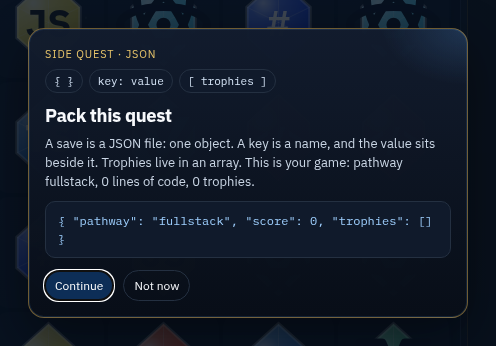
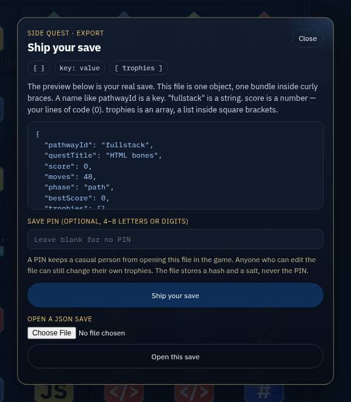

# Branchborne Gem Quest

Swap glowing tech gems, write lines of code, and walk a web-development career from the first HTML lesson to Senior — then class Expert raids.

This is a Bejeweled-style match-3 that teaches the web stack. Pick a pathway, clear side quests, collect trophies and loot, and ship your progress as a JSON file you can read.

## Why play

- Five doors into one cabinet: Classic learning path, Full-Stack Ranger, Frontend Mage, Backend Sentinel, and WordPress Artisan.
- The score is lines of code. Cascades, class powers, and later lessons write more of them.
- Each lesson is a live side quest with a short dev tip, a skill, and a trophy case that fills as you play.
- Save is a lesson too. Pack the quest as JSON, optionally lock the file with a PIN, and open it again later. Guest play needs no account.


Key art, generated for the pitch. It is not a screenshot of the cabinet.

## The cabinet






## Play it

### On your machine

No install step and no build. From the repository root:

```bash
python3 -m http.server 4173 --bind 0.0.0.0
```

Open [http://127.0.0.1:4173/](http://127.0.0.1:4173/). Pick a pathway, then swap adjacent gems.

### Public cabinet

The published cabinet is [https://gregarious-custard-70cf58.netlify.app](https://gregarious-custard-70cf58.netlify.app).

This repository includes the JSON Save flow. The public site shows that Save screen after this branch is deployed to production. Until that deploy, hard-refresh the live URL and treat the screenshots above as the Save flow in this commit.

## How to play

1. Choose a pathway. Classic learning path and Full-Stack Ranger share the full curriculum. The other three are shorter class paths, each with its own power.
2. Swap two gems that share an edge. Three or more of the same gem in a row or column clear, the stack falls, and cascades keep writing lines of code.
3. Read the side quest beside the board. Hint and Shuffle are there when the grid sticks. The class power charges as you match, then becomes Cast.
4. Open Trophies for the loot case. Customize changes the look and the music.
5. Save when you want a file you can carry. Not now leaves the board alone.

The full rules — pathways, scoring, trophies, the JSON lesson, the PIN, and opening a save — are in the [player guide](docs/game-guide.md).

## Save your quest

**Save** opens a side quest about JSON. Before a pathway is chosen, the card shows a labeled sample. After you pick one, the line is a snapshot of this run. **Continue** opens **Ship your save** in the same frame. **Not now**, the scrim behind the card, or Escape dismisses it and does not change the board.

**Ship your save** downloads `branchborne-save.json`. The card teaches the shape of that file against a preview of your real quest: one object, keys and values, `score` as a number (your lines of code), and `trophies` as an array. An optional PIN is 4–8 letters or digits. The file stores a SHA-256 hash of the salt, a newline, and the PIN. The raw PIN is not in the file, in this browser's storage, or in the log. Leave the PIN blank and the file still downloads and opens. **Open this save** loads a file of that shape back onto the board. A file that is not this cabinet's save says "That file is not a Branchborne save."

The Save screen does not ask for an email or a password. Guest play needs no account. The same quest also stays in this browser under `git-blocks-progress-v1:guest`.

A player who edits their own file can change their own lines of code and trophy list. That limit, and what Row Level Security does if a cloud row exists, is in [Security](docs/security.md).

## Pathways

| Pathway | Role | Power | Lessons |
| --- | --- | --- | --- |
| Classic learning path | Intern → Senior Developer | Polyglot Pulse | 20 |
| Full-Stack Ranger | Polyglot scout | Polyglot Pulse | 20 |
| Frontend Mage | UI spellcaster | Style Nova | 18 |
| Backend Sentinel | Server guardian | Query Storm | 15 |
| WordPress Artisan | CMS craftsperson | Hook Cascade | 15 |

Classic learning path and Full-Stack Ranger are two doors into the same curriculum. Gem marks are stylized teaching icons.

## For developers

The cabinet is static files at the repository root: `index.html`, `git-blocks.js`, `git-blocks.css`, and `audio/`. There is no bundler and no package manifest. `netlify.toml` publishes `.` and serves `GET /api/public-config` for the public Supabase URL and publishable key. Do not commit keys.

- [Development](docs/development.md) — layout, the local server, where the rules live, and how a change ships
- [Security](docs/security.md) — what is protected, and what a player can still edit
- [Support](docs/support.md) — browsers, sound, the JSON file, and how to reset local progress
- [Contributing](CONTRIBUTING.md)
- [Changelog](CHANGELOG.md)

The playable cabinet was copied from [matthummel-pa/matthummel-pa](https://github.com/matthummel-pa/matthummel-pa) (`game/`). The WordPress plugin sample in that repository was not copied.
