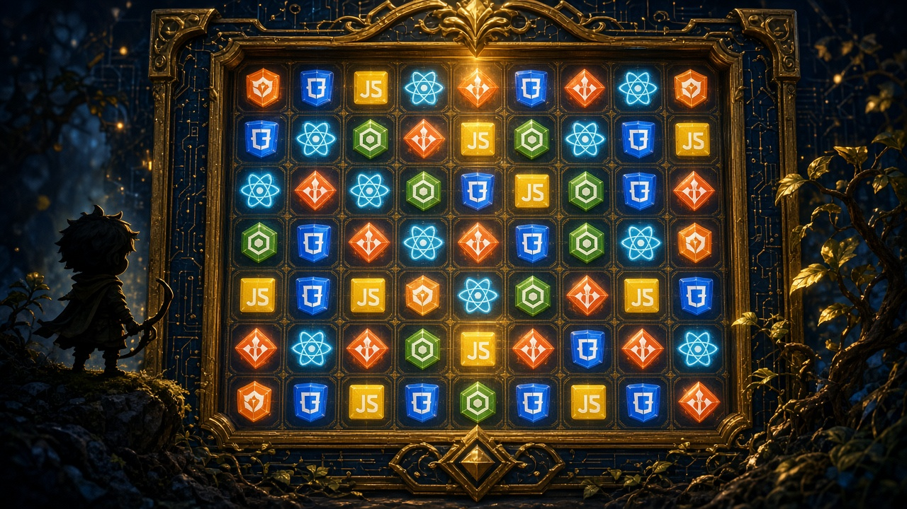
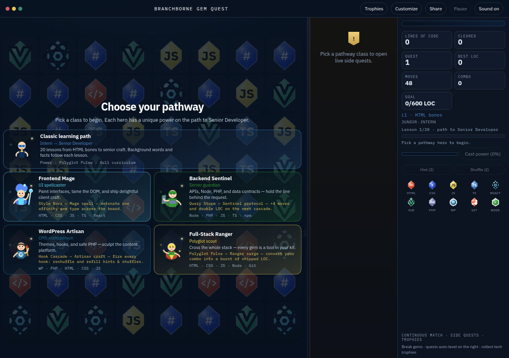
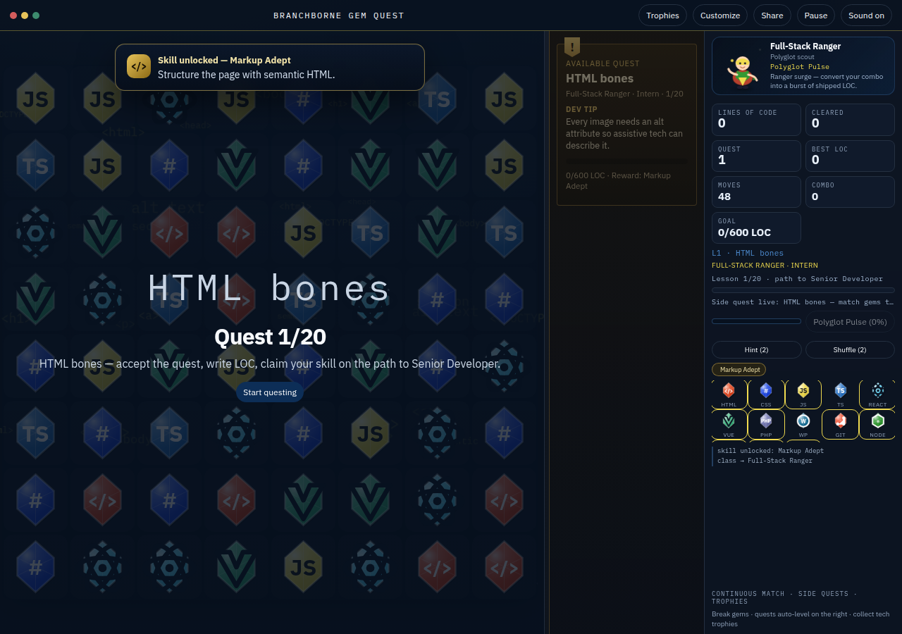
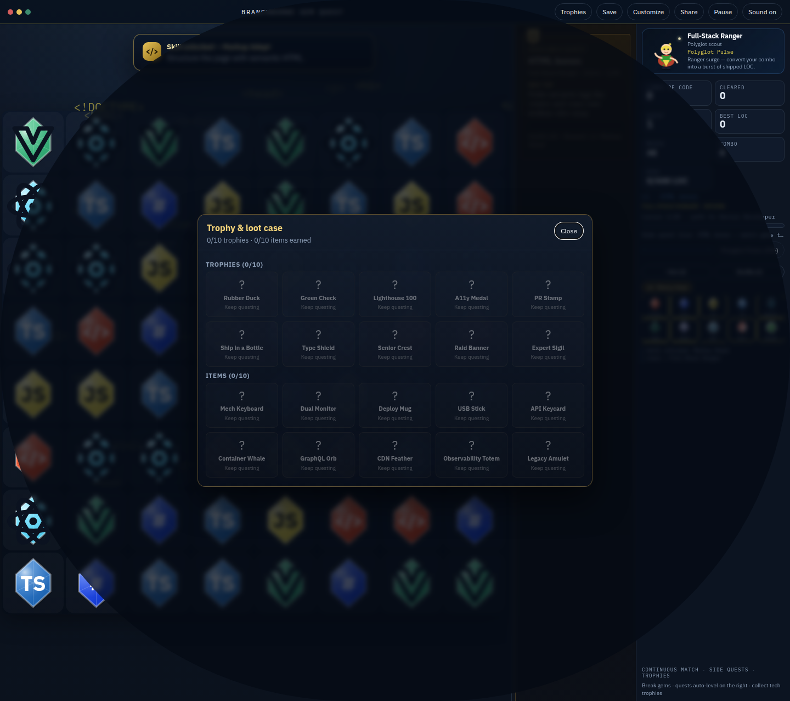
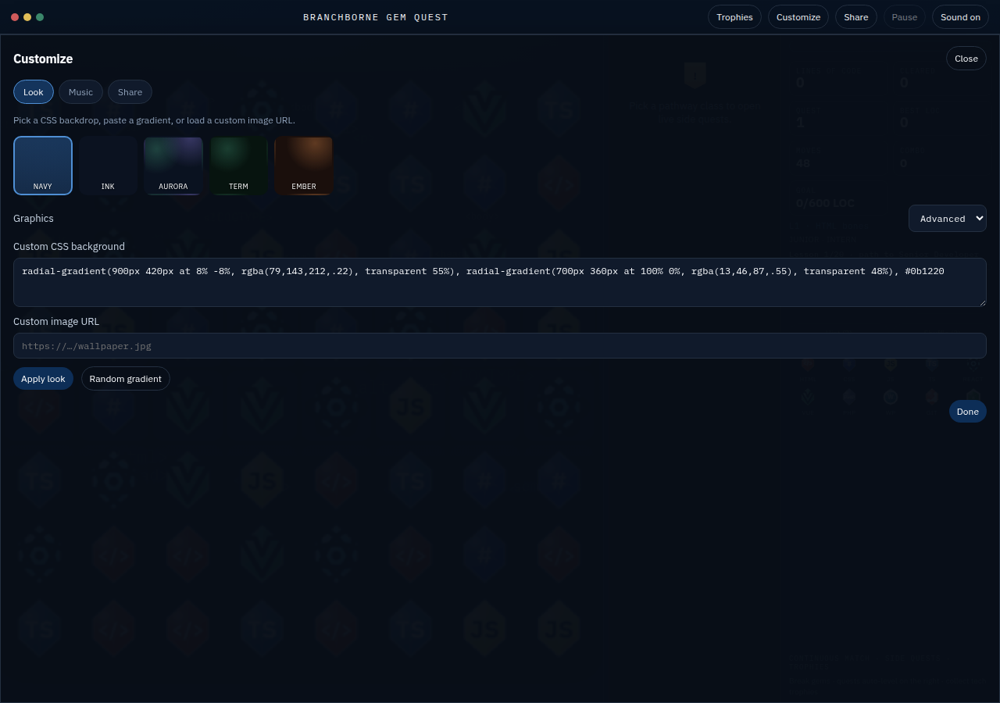
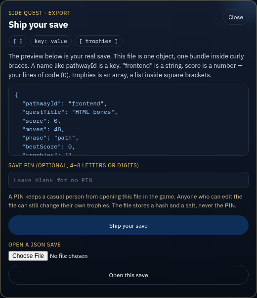

# Branchborne Gem Quest

A Bejeweled / Gems of War match-3 that teaches web development. Swap glowing tech gems, ship lines of code, clear live side quests, and walk a pathway from the first HTML lesson to Senior — then class Expert raids.

The playable cabinet is this repository: open `index.html` and the board is the game. The cabinet is the standalone player brought over from [matthummel-pa/matthummel-pa](https://github.com/matthummel-pa/matthummel-pa) (`game/`).



Key art, not a screenshot of the cabinet.

## The cabinet









## Play locally

No install step and no build. From the repository root:

```bash
python3 -m http.server 4173
```

Open [http://127.0.0.1:4173/](http://127.0.0.1:4173/). Pick a pathway, then swap adjacent gems.

## Save across browsers

**Save** in the cabinet chrome signs you in with email and password, or emails you a magic link. After a match, a trophy, a pause, or the end of a run, the cabinet writes pathway, quest, lines of code, moves, phase, best LOC, trophies, and loot to your Supabase account. A reload in another browser restores that row.



Cloud save uses Supabase project `ybmseuuumwiyudwqvzuh`. `SUPABASE_URL` is `https://ybmseuuumwiyudwqvzuh.supabase.co`. Open [https://supabase.com/dashboard/project/ybmseuuumwiyudwqvzuh](https://supabase.com/dashboard/project/ybmseuuumwiyudwqvzuh) for Authentication URL configuration. This project does not use an `allowed_users` allowlist.

With no Supabase URL configured, the same record stays in this browser under a guest `localStorage` key and the board still runs. A signed-in account uses its own key and does not pick up the guest save. See [Support](docs/support.md#cloud-save) for the environment variables and [Security](docs/security.md) for what that does and does not protect.

**Ship your save** on that same panel downloads `branchborne-save.json` with no account. The panel shows a short JSON lesson next to a preview of your real quest: the file is one object, `pathwayId` is a key, the pathway text is a string, `score` is a number (your lines of code), and `trophies` is an array. **Open this save** loads a file of that shape back onto the board. An optional PIN is 4–8 letters or digits. The file stores a SHA-256 hash and a salt, never the PIN. It only keeps a casual person from opening the file in the game. Anyone who can edit the JSON can still change their own trophies. A file with no PIN still downloads and imports.

## How a match works

The board is 8×8. Click a gem, then an adjacent gem, or drag between neighbors. Three or more of the same gem in a row or column clear, the stack falls, and cascades keep writing **lines of code** (LOC). The first quest asks for 600 LOC. Hint and Shuffle are on the side when the board gets stuck. A live side quest, with a short dev tip, sits beside the board.

## Pathways

Five start cards. Classic learning path and Full-Stack Ranger both open the same full curriculum (`fullstack`) and the same power.

| Pathway | Role | Power | Lessons |
| --- | --- | --- | --- |
| Classic learning path | Intern → Senior Developer | Polyglot Pulse | 20 |
| Full-Stack Ranger | Polyglot scout | Polyglot Pulse | 20 |
| Frontend Mage | UI spellcaster | Style Nova | 18 |
| Backend Sentinel | Server guardian | Query Storm | 15 |
| WordPress Artisan | CMS craftsperson | Hook Cascade | 15 |

Gem marks are stylized teaching icons.

## Docs

- [Player guide](docs/game-guide.md) — powers, scoring, quests, trophies, controls
- [Development](docs/development.md) — layout, where the rules live, Node sanity check
- [Support](docs/support.md) — browsers, sound, cloud save, reset, a board that will not start
- [Security](docs/security.md) — what is protected, what a player can still edit, how to report a problem
- [Contributing](CONTRIBUTING.md)
- [Changelog](CHANGELOG.md)
